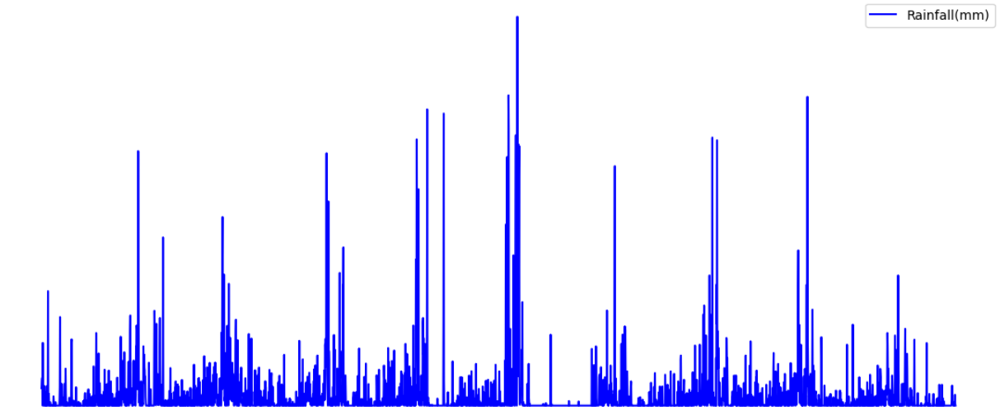
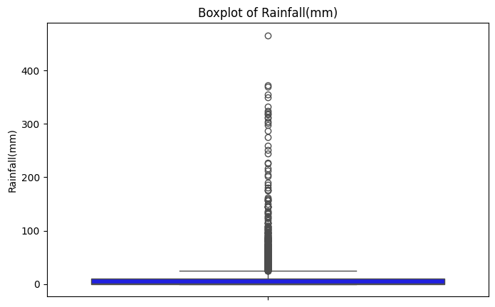
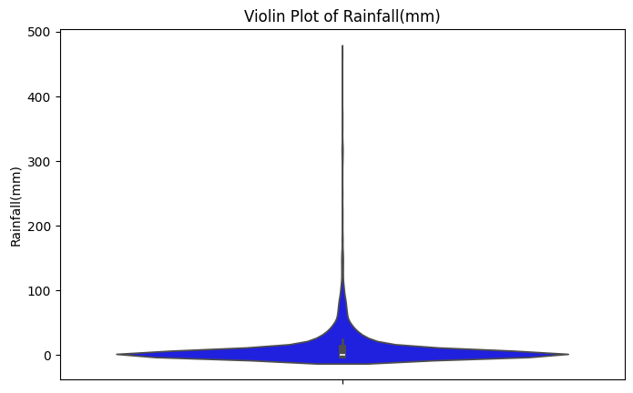
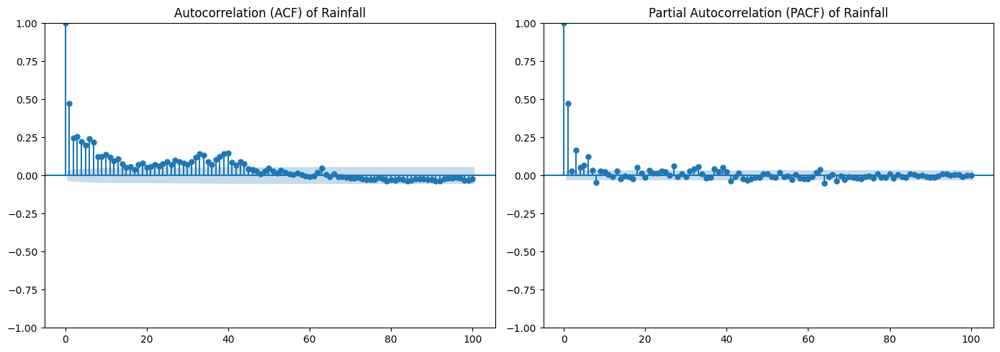
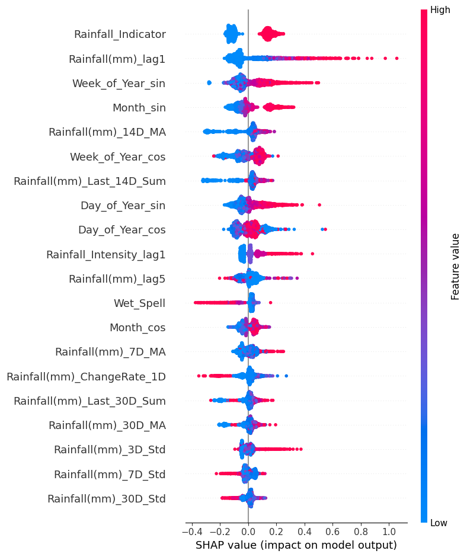
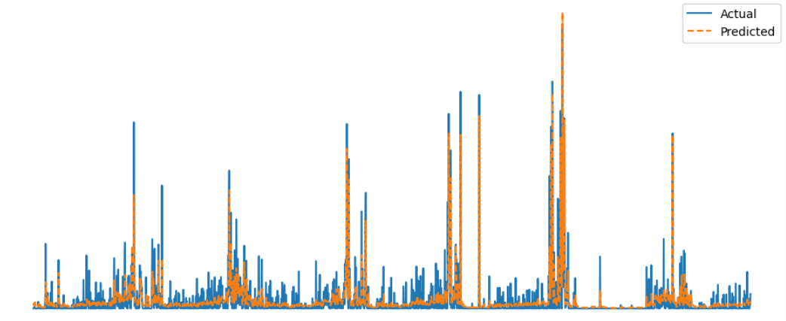
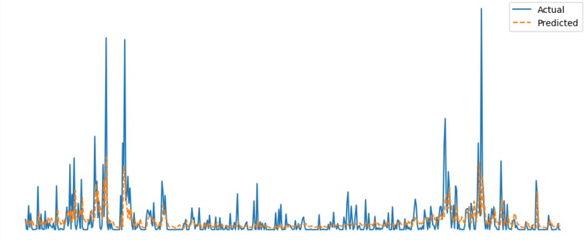
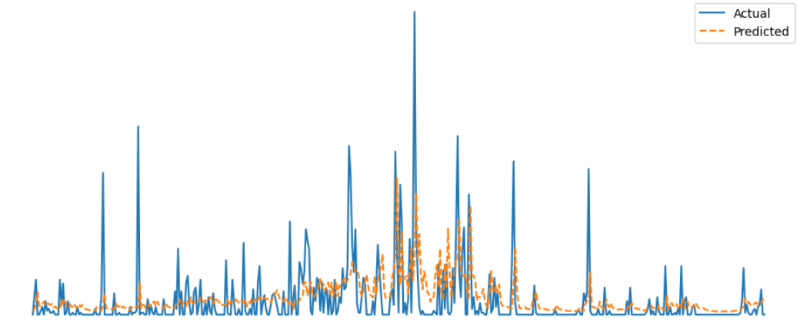

---
## 👋 Introduction

  

Welcome, and thank you for stopping by my data science and machine learning portfolio! 

I'm Yusuf, a part-time analytics postgraduate student at Georgia Tech and an aspiring applied data science and machine learning professional. This space brings together projects I've worked on through academic research, collaborations with universities, and self-guided learning.

These projects reflect my experience working with real-world data, where I’ve applied data science and machine learning techniques such as statistical analysis, regression modelling, and time series forecasting to uncover meaningful insights. While much of my work has been shaped by research-driven challenges in academic settings, I’ve also taken the initiative to explore ideas independently, building complete workflows from data preparation to model evaluation. The skills I’ve developed are highly transferable and relevant to any field where data plays a central role, and I’m always eager to explore new problem spaces and continue learning through hands-on work.

Thanks again for visiting, and I hope you find something here that interests you. Whether you're a hiring manager, data team lead, or just curious, I'm glad you're here!

---

## 🔍 What You'll Find Here

- A set of machine learning and analytics projects, with a focus on time series forecasting and regression modeling  
- Projects built through both collaborative research and independent study  
- Clear, well-structured summaries that explain the thinking behind each project  
- Documentation that aims to be understandable for both technical and non-technical readers

---

## 🗂️ Project Index

Click a project to jump to its section:

- [💧 Rain-Net: Daily Rainfall Forecasting (2025 - ongoing)](#rain-net-daily-rainfall-forecasting-2025---ongoing)
- [♟️ VersusAI: Monte Carlo Tree Search Variant Performance Prediction (2024)](#versusai-monte-carlo-tree-search-variant-performance-prediction-2024)
- [🚣 FlowTrack: River Streamflow Forecasting (2022)](#flowtrack-river-streamflow-forecasting-2022)
- [⛰️ SediSense: Suspended Sediment Load Forecasting (2022)](#sedisense-suspended-sediment-load-forecasting-2022)
- [🔆 SolarCast: Photovoltaic Solar Power Prediction (2022)](#solarcast-photovoltaic-solar-power-prediction-2022)

---

## Rain-Net: Daily Rainfall Forecasting (2025 - ongoing)

### 🔍 Overview

  

Rain-Net is an ongoing research collaboration with Sunway University, focused on developing a machine learning framework to forecast daily rainfall. Due to confidentiality, only selected aspects of the project are shared here.

- **Objective:** Forecast daily rainfall using data from an undisclosed station in Malaysia

- **Dataset:**
  - A relatively small dataset with just a few thousand daily rainfall observations
  - Univariate: only feature is daily rainfall

- **Problem characteristics:**
  - Heavy zero-inflation: most days have 0mm rainfall  
  - Occasional extreme events: daily rainfall reaching up to over 400mm a day
  - Data sparsity: a limited dataset makes learning challenging
- **Real-world relevance:** Mimics situations where stations lack sufficient historical data, yet forecasting remains crucial (e.g. flood/drought preparation)

The aim is to build a predictive model that can deliver rainfall forecasts with useful accuracy even in constrained settings.

  <figure align="center">
  
  <figcaption>Rain-Net Figure 1: Daily rainfall data over time, showcasing intermittent but intense rainfall spikes, with several pronounced peaks suggesting periods of extreme weather events. Most days experienced little to no rainfall, highlighting the sparse yet heavy nature of the rainfall distribution. (x and y axes are removed due to confidentiality requirements)</figcaption>
</figure>

---

### 📊 Data & Features

Given the dataset's limitations, heavy emphasis was placed on feature engineering to enrich the information available to the models. The following features are engineered from the original univariate dataset (consisting only of historical daily rainfall):

- **Seasonality Features (Cyclical Encoding):**
  - Month, day of year, and week of year represented using sine and cosine transformations to capture cyclical seasonal patterns

- **Lagged Rainfall Values:**
  - Rainfall and rainfall intensity values from the previous 1 to 7 days to model short-term temporal effects

- **Accumulation and Moving Averages:**
  - 7-day, 14-day, and 30-day moving averages of rainfall  
  - Total rainfall over the past 7, 14, and 30 days

- **Rainfall Variability:**
  - Rolling standard deviation over 3, 7, and 30-day windows to capture fluctuations in rainfall behaviour

- **Change Rate Features:**
  - Percentage change in rainfall over 1-day, 3-day, and 7-day periods to highlight recent changes or trends

- **Rainfall Indicators and Spell Tracking:**
  - Indicators for rainfall occurrence and extreme rainfall events  
  - Tracking of consecutive days with slight, moderate, heavy, or extreme rainfall  
  - Identification of prolonged dry and wet periods

---

### 🧪 Exploratory Data Analysis (EDA)

A detailed EDA was conducted to understand the dataset's structure and behaviour:

- **Descriptive statistics:**
  - Summary statistics of rainfall values  
  - Histogram showed high skewness: majority near 0mm with extreme outliers

<figure align="center">
  
  <figcaption>Rain-Net Figure 2: Histogram of daily rainfall showing a strong right skew, with most days experiencing low or no rainfall and fewer days with high rainfall amounts. This highlights the typical pattern of rainfall events being infrequent but occasionally intense.</figcaption>
</figure>

- **Outlier detection:**
  - Boxplots and violin plots helped identify spread and extreme events

<figure align="center">
  
  <figcaption>Rain-Net Figure 3: Boxplot showing most data points are tightly clustered near the lower end of the scale, with a long tail and many outliers indicating extreme rainfall events.</figcaption>
</figure>

<figure align="center">
  
  <figcaption>Rain-Net Figure 4: The violin plot shows a sharp peak near 0mm, reflecting the frequency of dry or light rainfall days, with a dense but slim distribution extending towards high rainfall values.</figcaption>
</figure>

- **Trend & seasonality:**
  - Decomposition into trend, seasonal, and residual components using time series methods

- **Temporal correlation:**
  - ACF and PACF plots analysed autocorrelation patterns and lag impact, identifying how past rainfall affects current-day prediction

<figure align="center">
  
  <figcaption>Rain-Net Figure 5: ACF and PACF plots show significant short-term autocorrelation, supporting the use of up to 7 lag days as predictive features.</figcaption>
</figure>

---

### 🧠 Methods & Models

- A combination of gradient boosting and neural network models were explored:
    - **Gradient boosting models (best performance):**
      - XGBoost, LightGBM, CatBoost  
      - Chosen for their robustness to sparse and small datasets
    - **Neural networks:**
      - Feedforward Neural Network (TensorFlow)  
      - Long short-term memory Neural Network
      - Transformer-based Neural Network (currently being prototyped)

- **Hyperparameter tuning:**
  - Used Optuna with Bayesian optimisation
    - More efficient than grid/random search once the hyperparameter spaces are constrained

- **Loss function:**
  - Tweedie regression applied due to its strength in handling zero-inflated continuous data  
  - Negative predictions clipped to zero to reflect physical realism

- **Interpretability (XAI):**
  - SHAP used to:
    - Understand feature importance  
    - Detect noisy or irrelevant features  
    - Guide feature pruning and simplification
   
<figure align="center">
  
  <figcaption>Rain-Net Figure 6: SHAP summary plot for the CatBoost model showing that the previous-day rainfall indicator, cyclical features, and short-term temporal features (e.g. previous 1 day rainfall, 14-day moving average) have the highest influence on model predictions, while longer-term or variability-based features have lower impact.</figcaption>
</figure>

- **Train-validate-test split:**
  - 70% train, 15% validation, 15% test  
  - 1-month temporal buffer between splits to reduce data leakage

- **Evaluation metrics:**
  - MAE (Mean Absolute Error): Measures average forecast error magnitude  
  - RMSE (Root Mean Square Error): Penalises larger errors; highlights poor performance during extreme rainfall  
  - NSE (Nash–Sutcliffe Efficiency): Indicates model improvement over baseline mean model; >0.5 considered usable in hydrological modelling

---

### 📈 Results & Evaluation

<figure align="center">
  
  <figcaption>Rain-Net Figure 7: In the training set, CatBoost closely matches actual rainfall values across a wide range of conditions. High rainfall events are well captured, suggesting strong model fit. However, care should be taken when evaluating performance on unseen data to ensure generalisability. (x and y axes are removed due to confidentiality requirements)</figcaption>
</figure>

<figure align="center">
  
  <figcaption>Rain-Net Figure 8: On the validation set, the CatBoost model successfully follows the general pattern of rainfall, especially during low to moderate rainfall days. While major spikes are present in the actual data, the model captures their timing but often underestimates their magnitude. (x and y axes are removed due to confidentiality requirements)</figcaption>
</figure>

<figure align="center">
  
  <figcaption>Rain-Net Figure 9: CatBoost rainfall forecasting on the test set shows strong alignment between predicted and actual values during dry periods, with reasonable tracking of rainfall trends overall. Peak rainfall events tend to be underpredicted, highlighting the model's difficulty in capturing extremes. (x and y axes are removed due to confidentiality requirements)</figcaption>
</figure>

- **Current best performance on train set (CatBoost):**
  - MAE: 9.071 mm  
  - RMSE: 15.543 mm  
  - NSE: 0.801

- **Current best performance on validation set (CatBoost):**
  - MAE: 15.334 mm  
  - RMSE: 30.866 mm  
  - NSE: 0.226

- **Current best performance on test set (CatBoost):**
  - MAE: 8.633 mm  
  - RMSE: 14.908 mm  
  - NSE: 0.133 (Low, but expected due to data limitations and high variance from extremes)

---

### 🛠️ Tools & Libraries

- **Data Processing:**
  - Python, Pandas, NumPy

- **Visualisation:**
  - Matplotlib, Seaborn

- **Modelling:**
  - XGBoost, LightGBM, CatBoost  
  - TensorFlow, PyTorch

- **Evaluation & Optimisation:**
  - Scikit-learn, Optuna

- **Interpretability:**
  - SHAP

- **Environment:**
  - Jupyter (on Google Colab)

---

### 💡 Key Takeaways

- Tailored feature engineering is critical when data is limited and noisy  
- Tree-based models remain strong candidates in low data volume contexts  
- SHAP allows meaningful evaluation of feature contributions, helping streamline and improve model design  
- Evaluation metrics like NSE require careful interpretation, especially in extreme-value-heavy data

---

### 🔄 Ongoing Work

- **Log transformation:**  
  Log-transformed targets may reduce skewness and variance, stabilising model training and improving extreme-value handling

- **Two-stage modelling pipeline:**  
  Exploring use of a classifier to predict rainfall occurrence (dry vs wet day), followed by a regressor to predict rainfall amount. This approach may reduce noise introduced by non-rain days and improve accuracy of forecasts

---

## VersusAI: Monte Carlo Tree Search Variant Performance Prediction (2024)

⚙️ This project is in progress! I'm piecing it together and digging through my old work like a data archaeologist. Just need a bit more time to get everything organised and properly displayed here. In the meantime, feel free to explore my work on the Rain-Net project!

### 🔍 Overview
*Coming soon...*

### 📊 Data & Features
*Coming soon...*

### 🧪 Exploratory Data Analysis (EDA)
*Coming soon...*

### 🧠 Methods & Models
*Coming soon...*

### 📈 Results & Evaluation
*Coming soon...*

### 🛠️ Tools & Libraries
*Coming soon...*

### 💡 Key Takeaways
*Coming soon...*

---

## FlowTrack: River Streamflow Forecasting (2022)

⚙️ This project is in progress! I'm piecing it together and digging through my old work like a data archaeologist. Just need a bit more time to get everything organised and properly displayed here. In the meantime, feel free to explore my work on the Rain-Net project!

### 🔍 Overview
*Coming soon...*

### 📊 Data & Features
*Coming soon...*

### 🧪 Exploratory Data Analysis (EDA)
*Coming soon...*

### 🧠 Methods & Models
*Coming soon...*

### 📈 Results & Evaluation
*Coming soon...*

### 🛠️ Tools & Libraries
*Coming soon...*

### 💡 Key Takeaways
*Coming soon...*

---

## SediSense: Suspended Sediment Load Forecasting (2022)

⚙️ This project is in progress! I'm piecing it together and digging through my old work like a data archaeologist. Just need a bit more time to get everything organised and properly displayed here. In the meantime, feel free to explore my work on the Rain-Net project!

### 🔍 Overview
*Coming soon...*

### 📊 Data & Features
*Coming soon...*

### 🧪 Exploratory Data Analysis (EDA)
*Coming soon...*

### 🧠 Methods & Models
*Coming soon...*

### 📈 Results & Evaluation
*Coming soon...*

### 🛠️ Tools & Libraries
*Coming soon...*

### 💡 Key Takeaways
*Coming soon...*

## SolarCast: Photovoltaic Solar Power Prediction (2022)

⚙️ This project is in progress! I'm piecing it together and digging through my old work like a data archaeologist. Just need a bit more time to get everything organised and properly displayed here. In the meantime, feel free to explore my work on the Rain-Net project!

### 🔍 Overview
*Coming soon...*

### 📊 Data & Features
*Coming soon...*

### 🧪 Exploratory Data Analysis (EDA)
*Coming soon...*

### 🧠 Methods & Models
*Coming soon...*

### 📈 Results & Evaluation
*Coming soon...*

### 🛠️ Tools & Libraries
*Coming soon...*

### 💡 Key Takeaways
*Coming soon...*
