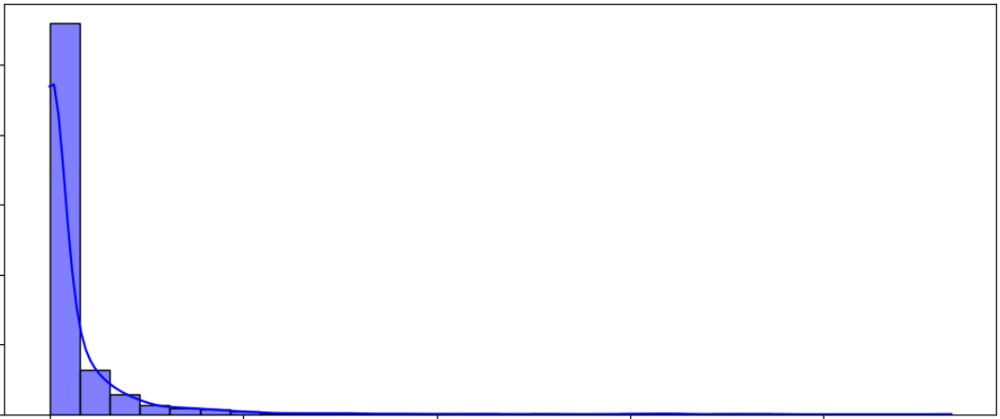

---
## 👋 Introduction

  

Welcome, and thank you for stopping by my data science and machine learning portfolio! 

I'm Yusuf, a part-time analytics postgraduate student at Georgia Tech and an aspiring applied data science and machine learning professional. This space brings together projects I've worked on through academic research, collaborations with universities, and self-guided learning.

These projects reflect my experience working with real-world data, where I’ve applied data science and machine learning techniques such as statistical analysis, regression modelling, and time series forecasting to uncover meaningful insights. While much of my work has been shaped by research-driven challenges in academic settings, I’ve also taken the initiative to explore ideas independently, building complete workflows from data preparation to model evaluation. The skills I’ve developed are highly transferable and relevant to any field where data plays a central role, and I’m always eager to explore new problem spaces and continue learning through hands-on work.

Thanks again for visiting, and I hope you find something here that interests you. Whether you're a hiring manager, data team lead, or just curious, I'm glad you're here!

---

## 🔍 What You'll Find Here

- A set of machine learning and analytics projects, with a focus on time series forecasting and regression modeling  
- Projects built through both collaborative research and independent study  
- Clear, well-structured summaries that explain the thinking behind each project  
- Documentation that aims to be understandable for both technical and non-technical readers

---

## 🗂️ Project Index

Click a project to jump to its section:

- [💧 Rain-Net: Daily Rainfall Forecasting (2025 - ongoing)](#rain-net-daily-rainfall-forecasting-2025---ongoing)
- [♟️ VersusAI: Monte Carlo Tree Search Variant Performance Prediction (2024)](#versusai-monte-carlo-tree-search-variant-performance-prediction-2024)
- [🚣 FlowTrack: River Streamflow Forecasting (2022)](#flowtrack-river-streamflow-forecasting-2022)
- [⛰️ SediSense: Suspended Sediment Load Forecasting (2022)](#sedisense-suspended-sediment-load-forecasting-2022)
- [🔆 SolarCast: Photovoltaic Solar Power Prediction (2022)](#solarcast-photovoltaic-solar-power-prediction-2022)

---

## Rain-Net: Daily Rainfall Forecasting (2025 - ongoing)

### 🔍 Overview

  

Rain-Net is an ongoing research collaboration with Sunway University, focused on developing a machine learning framework to forecast daily rainfall. Due to confidentiality, only selected aspects of the project are shared here as this is still an ongoing work and yet to be published. Project code and raw data will not be shared, but key methodologies and results are summarised below.

- **Objective:** Forecast daily rainfall using data from an undisclosed station in Malaysia

- **Dataset:**
  - A relatively small dataset with just a few thousand daily rainfall observations
  - Univariate: only feature is daily rainfall

- **Problem characteristics:**
  - Heavy zero-inflation: most days have 0mm rainfall  
  - Occasional extreme events: daily rainfall reaching up to over 400mm a day
  - Data sparsity: a limited dataset makes learning challenging
- **Real-world relevance:** Mimics situations where stations lack sufficient historical data, yet forecasting remains crucial (e.g. flood/drought preparation)

The aim is to build a predictive model that can deliver rainfall forecasts with useful accuracy even in constrained settings.

  <figure align="center">
  
  <figcaption>Rain-Net Figure 1: Daily rainfall data over time, showcasing intermittent but intense rainfall spikes, with several pronounced peaks suggesting periods of extreme weather events. Most days experienced little to no rainfall, highlighting the sparse yet heavy nature of the rainfall distribution. (x and y axes are removed due to confidentiality requirements)</figcaption>
</figure>

---

### 📊 Data & Features

Given the dataset's limitations, heavy emphasis was placed on feature engineering to enrich the information available to the models. The following features are engineered from the original univariate dataset (consisting only of historical daily rainfall):

- **Seasonality Features (Cyclical Encoding):**
  - Month, day of year, and week of year represented using sine and cosine transformations to capture cyclical seasonal patterns

- **Lagged Rainfall Values:**
  - Rainfall and rainfall intensity values from the previous 1 to 7 days to model short-term temporal effects

- **Accumulation and Moving Averages:**
  - 7-day, 14-day, and 30-day moving averages of rainfall  
  - Total rainfall over the past 7, 14, and 30 days

- **Rainfall Variability:**
  - Rolling standard deviation over 3, 7, and 30-day windows to capture fluctuations in rainfall behaviour

- **Change Rate Features:**
  - Percentage change in rainfall over 1-day, 3-day, and 7-day periods to highlight recent changes or trends

- **Rainfall Indicators and Spell Tracking:**
  - Indicators for rainfall occurrence and extreme rainfall events  
  - Tracking of consecutive days with slight, moderate, heavy, or extreme rainfall  
  - Identification of prolonged dry and wet periods

---

### 🧪 Exploratory Data Analysis (EDA)

A detailed EDA was conducted to understand the dataset's structure and behaviour:

- **Descriptive statistics:**
  - Summary statistics of rainfall values  
  - Histogram showed high skewness: majority near 0mm with extreme outliers

<figure align="center">
  
  <figcaption>Rain-Net Figure 2: Histogram of daily rainfall showing a strong right skew, with most days experiencing low or no rainfall and fewer days with high rainfall amounts. This highlights the typical pattern of rainfall events being infrequent but occasionally intense. (x and y axes are removed due to confidentiality requirements)</figcaption>
</figure>

- **Outlier detection:**
  - Boxplots and violin plots helped identify spread and extreme events

<figure align="center">
  
  <figcaption>Rain-Net Figure 3: Boxplot showing most data points are tightly clustered near the lower end of the scale, with a long tail and many outliers indicating extreme rainfall events.</figcaption>
</figure>

<figure align="center">
  
  <figcaption>Rain-Net Figure 4: The violin plot shows a sharp peak near 0mm, reflecting the frequency of dry or light rainfall days, with a dense but slim distribution extending towards high rainfall values.</figcaption>
</figure>

- **Trend & seasonality:**
  - Decomposition into trend, seasonal, and residual components using time series methods

- **Temporal correlation:**
  - ACF and PACF plots analysed autocorrelation patterns and lag impact, identifying how past rainfall affects current-day prediction

<figure align="center">
  
  <figcaption>Rain-Net Figure 5: ACF and PACF plots show significant short-term autocorrelation, supporting the use of up to 7 lag days as predictive features.</figcaption>
</figure>

---

### 🧠 Methods & Models

- A combination of gradient boosting and neural network models were explored:
    - **Gradient boosting models (best performance):**
      - XGBoost, LightGBM, CatBoost  
      - Chosen for their robustness to sparse and small datasets
    - **Neural networks:**
      - Feedforward Neural Network (TensorFlow)  
      - Long short-term memory Neural Network
      - Transformer-based Neural Network (currently being prototyped)

- **Hyperparameter tuning:**
  - Used Optuna with Bayesian optimisation
    - More efficient than grid/random search once the hyperparameter spaces are constrained

- **Loss function:**
  - Tweedie regression applied due to its strength in handling zero-inflated continuous data  
  - Negative predictions clipped to zero to reflect physical realism

- **Interpretability (XAI):**
  - SHAP used to:
    - Understand feature importance  
    - Detect noisy or irrelevant features  
    - Guide feature pruning and simplification
   
<figure align="center">
  
  <figcaption>Rain-Net Figure 6: SHAP summary plot for the CatBoost model showing that the previous-day rainfall indicator, cyclical features, and short-term temporal features (e.g. previous 1 day rainfall, 14-day moving average) have the highest influence on model predictions, while longer-term or variability-based features have lower impact.</figcaption>
</figure>

- **Train-validate-test split:**
  - 70% train, 15% validation, 15% test  
  - 1-month temporal buffer between splits to reduce data leakage

- **Evaluation metrics:**
  - MAE (Mean Absolute Error): Measures average forecast error magnitude  
  - RMSE (Root Mean Square Error): Penalises larger errors; highlights poor performance during extreme rainfall  
  - NSE (Nash–Sutcliffe Efficiency): Indicates model improvement over baseline mean model; >0.5 considered usable in hydrological modelling

---

### 📈 Results & Evaluation

While the overall performance still leaves room for improvement, CatBoost currently stands out as the best-performing model among those tested. It provides relatively lower error metrics across the training, validation, and test sets, and handles the general rainfall patterns better than other models. Despite a low NSE on the test set, which is expected due to data limitations and high variability, CatBoost remains the most promising model in this study so far.

<figure align="center">
  
  <figcaption>Rain-Net Figure 7: In the training set, CatBoost closely matches actual rainfall values across a wide range of conditions. High rainfall events are well captured, suggesting strong model fit. However, care should be taken when evaluating performance on unseen data to ensure generalisability. (x and y axes are removed due to confidentiality requirements)</figcaption>
</figure>

<figure align="center">
  
  <figcaption>Rain-Net Figure 8: On the validation set, the CatBoost model successfully follows the general pattern of rainfall, especially during low to moderate rainfall days. While major spikes are present in the actual data, the model captures their timing but often underestimates their magnitude. (x and y axes are removed due to confidentiality requirements)</figcaption>
</figure>

<figure align="center">
  
  <figcaption>Rain-Net Figure 9: CatBoost rainfall forecasting on the test set shows strong alignment between predicted and actual values during dry periods, with reasonable tracking of rainfall trends overall. Peak rainfall events tend to be underpredicted, highlighting the model's difficulty in capturing extremes. (x and y axes are removed due to confidentiality requirements)</figcaption>
</figure>

- **Current best performance on train set (CatBoost):**
  - MAE: 9.071 mm  
  - RMSE: 15.543 mm  
  - NSE: 0.801

- **Current best performance on validation set (CatBoost):**
  - MAE: 15.334 mm  
  - RMSE: 30.866 mm  
  - NSE: 0.226

- **Current best performance on test set (CatBoost):**
  - MAE: 8.633 mm  
  - RMSE: 14.908 mm  
  - NSE: 0.133 (Low, but expected due to data limitations and high variance from extremes)

---

### 🛠️ Tools & Libraries

- **Data Processing:**
  - Python, Pandas, NumPy

- **Visualisation:**
  - Matplotlib, Seaborn

- **Modelling:**
  - XGBoost, LightGBM, CatBoost  
  - TensorFlow, PyTorch

- **Evaluation & Optimisation:**
  - Scikit-learn, Optuna

- **Interpretability:**
  - SHAP

- **Environment:**
  - Jupyter (on Google Colab)

---

### 💡 Key Takeaways

- Tailored feature engineering is critical when data is limited and noisy  
- Tree-based models remain strong candidates in low data volume contexts  
- SHAP allows meaningful evaluation of feature contributions, helping streamline and improve model design  
- Evaluation metrics like NSE require careful interpretation, especially in extreme-value-heavy data

---

### 🔄 Ongoing Work

- **Log transformation:**  
  Log-transformed targets may reduce skewness and variance, stabilising model training and improving extreme-value handling

- **Two-stage modelling pipeline:**  
  Exploring use of a classifier to predict rainfall occurrence (dry vs wet day), followed by a regressor to predict rainfall amount. This approach may reduce noise introduced by non-rain days and improve accuracy of forecasts

---

## VersusAI: Monte Carlo Tree Search Variant Performance Prediction (2024)

**⚙️ This project is in progress! I'm piecing it together and digging through my old work like a data archaeologist. Just need a bit more time to get everything organised and properly displayed here. In the meantime, feel free to explore my work on the Rain-Net project!**

### 🔍 Overview
*Coming soon...*

### 📊 Data & Features
*Coming soon...*

### 🧪 Exploratory Data Analysis (EDA)
*Coming soon...*

### 🧠 Methods & Models
*Coming soon...*

### 📈 Results & Evaluation
*Coming soon...*

### 🛠️ Tools & Libraries
*Coming soon...*

### 💡 Key Takeaways
*Coming soon...*

---

## FlowTrack: River Streamflow Forecasting (2022)

**⚙️ This project is in progress! I'm piecing it together and digging through my old work like a data archaeologist. Just need a bit more time to get everything organised and properly displayed here. In the meantime, feel free to explore my work on the Rain-Net project!**

### 🔍 Overview

  

FlowTrack is a completed machine learning research project conducted under Universiti Tenaga Nasional, focused on forecasting daily river streamflow across multiple rivers in Peninsular Malaysia. The study addresses a critical research gap: whether a single model can generalise effectively across diverse river systems.

The overall findings have been published in *Scientific Reports* by *Nature* and can be accessed [here](https://www.nature.com/articles/s41598-022-07693-4). Due to confidentiality requirements, project code and raw data will not be shared, but key methodologies and results are summarised below.

- **Objective:** Forecast daily streamflow using historical streamflow data from 11 different rivers across Peninsular Malaysia

- **Dataset:**
  - 11 univariate daily streamflow datasets sourced from the Malaysian Department of Irrigation and Drainage
  - Coverage spans various states and river basins with differing flow characteristics

- **Problem characteristics:**
  - Highly variable streamflow magnitudes across rivers
  - Temporal and spatial heterogeneity
  - Potential data noise and discontinuity (e.g. missing values, non-stationarity)

- **Real-world relevance:**
  - Supports flood and drought mitigation, water resource planning, hydropower operations, and pollution monitoring
  - Promotes the idea of a resource-efficient, universal streamflow forecasting model

<figure align="center">
  
  <figcaption>FlowTrack Figure 1: Streamflow time series showing variation in magnitude and fluctuation frequency across different rivers. (x and y axes are removed due to confidentiality requirements)</figcaption>
</figure>

---

### 📊 Data & Features

The study focuses on univariate time series forecasting, where only past streamflow values are originally available to be used as inputs. Based on statistical analysis and autocorrelation studies, lagged streamflow values were selected as predictors.

- **Rivers Analysed:**
  - Sungai Johor *(Johor)*
  - Sungai Muda *(Kedah)*
  - Sungai Kelantan *(Kelantan)*
  - Sungai Melaka *(Melaka)*
  - Sungai Kepis *(Negeri Sembilan)*
  - Sungai Pahang *(Pahang)*
  - Sungai Perak *(Perak)*
  - Sungai Arau *(Perlis)*
  - Sungai Selangor *(Selangor)*
  - Sungai Dungun *(Terengganu)*
  - Sungai Klang *(Federal Territory of Kuala Lumpur)*

- **Lag Features:**
  - Lag-1, Lag-2, and Lag-3 values of streamflow were identified as the most relevant lags for forecasting, based on PACF and Pearson correlation analysis
  - Three input scenarios tested:
    - Scenario 1: SF(t-1)
    - Scenario 2: SF(t-1), SF(t-2)
    - Scenario 3: SF(t-1), SF(t-2), SF(t-3)

- **Preprocessing:**
  - Linear interpolation used to fill missing values
  - Feature scaling:
    - Standardisation for SVM
    - Normalisation for ANN and LSTM
  - Sliding windows used to frame forecasting as a supervised learning task

At the time of conducting this research, the focus was kept on a minimal univariate setup using lagged features. While more advanced feature engineering might have improved model performance, such as including seasonality indicators, rolling statistics, or rainfall as an additional input, my understanding of these techniques was still in progress. Looking back, incorporating these could have offered better temporal context and generalisation, especially for rivers with highly variable flow. This is something I’ve started exploring and implementing in more recent projects.

---

### 🧪 Exploratory Data Analysis (EDA)

A thorough EDA was conducted to understand streamflow behaviour and inform model design:

- **Descriptive statistics:**
  - Daily streamflow values varied greatly between rivers, with some showing steady base flow and others displaying frequent spikes
  - Summary statistics revealed skewness in multiple datasets due to infrequent but intense flow periods

- **Visual patterns:**
  - Line plots showed rivers with both consistent trends and erratic fluctuations
  - Time series plots were used to explore temporal dynamics and outliers

- **Autocorrelation analysis:**
  - ACF and PACF plots were generated for each river
  - Most rivers showed strong short-term autocorrelation, supporting the use of Lag-1 to Lag-3 values

- **Correlation analysis:**
  - Pearson correlation coefficients were calculated between lagged streamflow values and the current day's streamflow
  - Lag-1 to Lag-3 values consistently showed the strongest correlations, reinforcing their use as predictive features

- **Missing data detection and imputation:**
  - Gaps in data were identified and addressed using the `imputeTS` R package
  - Both linear and spline interpolation methods were tested; spline interpolation occasionally introduced negative values, so linear interpolation was selected as the more reliable approach
  - This step ensured temporal continuity, which is critical for supervised learning

<figure align="center">
  
  <figcaption>FlowTrack Figure 2: ACF and PACF plots highlight short-term temporal dependencies, validating the inclusion of lagged streamflow features. (x and y axes are removed due to confidentiality requirements)</figcaption>
</figure>

---

### 🧠 Methods & Models

- Three forecasting algorithms were used to develop the models:
  - **Support Vector Machine (SVM):** Used a radial basis function (RBF) kernel. Minimal tuning was required, and it was generally robust in high-dimensional settings.
  - **Artificial Neural Network (ANN):** A feedforward neural network consisting of two hidden layers with 6 neurons each, ReLU activation, and the Adam optimiser. Trained over 100 epochs with early stopping based on validation loss.
  - **Long Short-Term Memory (LSTM):** Used two hidden layers with 50 neurons each, tanh activation, and sigmoid recurrent activation. Dropout regularisation was applied to reduce overfitting.

- **Train-validate-test split:**
  - 80% of each river’s streamflow data was used for training and 20% for testing
  - The training set was further split into a training and validation set, with the validation portion set to 20% of the training data
  - The 20% validation size was selected through trial and error, as it more consistently produced the best results during training and fine-tuning

- **Evaluation metrics:**
  - MAE (Mean Absolute Error): Measures average magnitude of forecast error, giving equal weight to all errors
  - RMSE (Root Mean Square Error): Penalises larger errors more heavily than MAE, making it useful for highlighting poor performance during extreme flows
  - R² (Coefficient of Determination): Indicates the proportion of variance in the streamflow data that is explained by the model
  - RM (Ranking Mean): Average ranking of each model across all metrics to identify the best-performing one

- **Hyperparameter tuning:**
  - A trial-and-error approach was used to find suitable hyperparameter settings that would perform reasonably across all rivers
  - While this method yielded workable models, it was not the most efficient or optimal
  - In hindsight, a more systematic method such as Bayesian optimisation would have likely improved model performance and generalisability

---

### 📈 Results & Evaluation

Among the 99 models tested across 11 river datasets, the ANN3 model (Artificial Neural Network with Scenario 3 input lags) consistently emerged as the best performer. It ranked first in 4 out of 11 rivers (Sungai Johor, Sungai Pahang, Sungai Arau, Sungai Selangor) and achieved the second-best average RM score (3.27), just marginally behind ANN2 (3.21). Despite this, ANN3 is selected as the best overall model due to its superior ability to produce top-performing forecasts across more rivers.

<figure align="center">
  
  <figcaption>FlowTrack Figure 3: ANN3 showed robust forecasting ability across diverse streamflow profiles, capturing both low and high flow periods effectively. (x and y axes are removed due to confidentiality requirements)</figcaption>
</figure>

- **Strengths of ANN3:**
  - Outperformed all other models in 4 out of 11 rivers, more than any other model
  - Among the top in overall reliability and average performance across datasets
  - Accurately captured sharp streamflow spikes better than other models

- **Overall insights:**
  - **ANN** was the most dominant algorithm across the study, outperforming SVM and LSTM in 7 out of 11 datasets
  - **Input Scenario 3** (lag-1, lag-2, lag-3) led to the highest number of top predictions, suggesting value in including three days of historical input
  - **SVM** showed strong performance in specific rivers (e.g. Sungai Muda, Sungai Kelantan, Sungai Klang) but lacked consistency overall
  - **LSTM** underperformed, likely due to the limited length of training sequences, high variance in streamflow data, and absence of multivariate inputs that typically enhance LSTM performance

- **Model limitations:**
  - Some rivers with high variability or poor data quality still resulted in lower accuracy
  - Hyperparameter tuning via trial-and-error may have limited full model potential

---

### 🛠️ Tools & Libraries

- **Data Processing:**
  - Python, Pandas, NumPy

- **Visualisation:**
  - Matplotlib, Seaborn

- **Modelling:**
  - Scikit-learn (SVM)
  - TensorFlow (ANN, LSTM)

- **Notebook Environment:**
  - Jupyter (on Google Colab)

---

### 💡 Key Takeaways

- **ANN3** (ANN with 3-day lag input) is proposed as the most effective and generalisable model for streamflow forecasting across Peninsular Malaysia  
- **Lag-based univariate features** (especially Lag-1 to Lag-3) are strong predictors, particularly when autocorrelation is present  
- **Artificial Neural Networks** consistently outperformed SVM and LSTM models, especially in capturing sharp fluctuations in streamflow  
- **Model simplicity** (e.g. shallow ANN architecture) can deliver strong results, highlighting the benefit of well-tuned, lightweight models for real-world applications  
- **Scenario 3** (using three previous days of streamflow data) provided the best predictive input configuration overall  

---

### 🚧 Room for Improvement

- **Feature Engineering:** The project focused on lag-based univariate forecasting. Incorporating additional features like seasonality indicators, rainfall data, and rolling statistics may improve performance—especially for rivers with highly variable or extreme flow.  
- **Hyperparameter Optimisation:** A more systematic method such as Bayesian optimisation could improve model generalisability across rivers and avoid trial-and-error inefficiencies.  
- **Model Architecture Exploration:** Deeper or hybrid models (e.g. CNN-LSTM or ensemble approaches) could be explored in future work to further boost accuracy and handle nonlinearities in complex rivers.  
- **Multivariate Forecasting:** The current setup is univariate. Introducing multivariate models with environmental predictors (rainfall, temperature, land use) could better reflect real-world hydrological processes.

---

## SediSense: Suspended Sediment Load Forecasting (2022)

**⚙️ This project is in progress! I'm piecing it together and digging through my old work like a data archaeologist. Just need a bit more time to get everything organised and properly displayed here. In the meantime, feel free to explore my work on the Rain-Net project!**

### 🔍 Overview
*Coming soon...*

### 📊 Data & Features
*Coming soon...*

### 🧪 Exploratory Data Analysis (EDA)
*Coming soon...*

### 🧠 Methods & Models
*Coming soon...*

### 📈 Results & Evaluation
*Coming soon...*

### 🛠️ Tools & Libraries
*Coming soon...*

### 💡 Key Takeaways
*Coming soon...*

## SolarCast: Photovoltaic Solar Power Prediction (2022)

**⚙️ This project is in progress! I'm piecing it together and digging through my old work like a data archaeologist. Just need a bit more time to get everything organised and properly displayed here. In the meantime, feel free to explore my work on the Rain-Net project!**

### 🔍 Overview
*Coming soon...*

### 📊 Data & Features
*Coming soon...*

### 🧪 Exploratory Data Analysis (EDA)
*Coming soon...*

### 🧠 Methods & Models
*Coming soon...*

### 📈 Results & Evaluation
*Coming soon...*

### 🛠️ Tools & Libraries
*Coming soon...*

### 💡 Key Takeaways
*Coming soon...*
